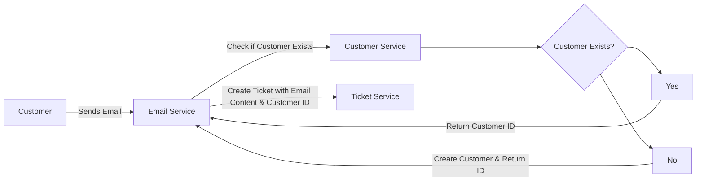
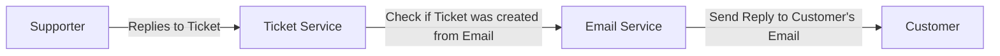
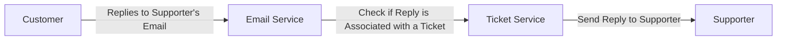

# Messaging Flows

This document describes the messaging flows for the application. It covers the different types of messages, their formats, and how they are processed within the system.

### Supporter Replies To Ticket created from Email

When a supporter replies to a ticket that was created from an email, the following flow occurs:

### Customer Replies To Supporter Reply from Ticket created from Email

When a customer replies to a supporter's reply, the following flow occurs:

