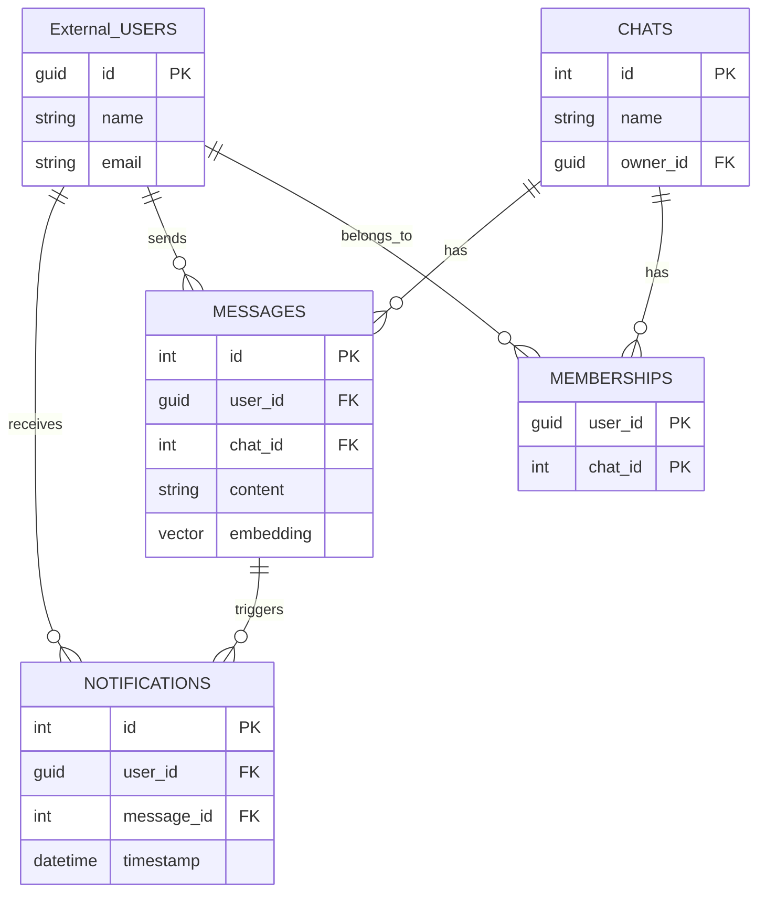

```mermaid
erDiagram
	direction TB
	CHATS {
		int id PK 
		string name
		guid owner_id FK
	}

	External_USERS {
	    guid id PK
		string name
		string email
	}

	MEMBERSHIPS {
		guid user_id PK
		int chat_id PK
	}

	MESSAGES {
		int id PK
		guid user_id FK
		int chat_id FK
		string content
		vector embedding
	}

	NOTIFICATIONS {
		int id PK
		guid user_id FK
		int message_id FK
		datetime timestamp
	}


	
	External_USERS ||--o{ NOTIFICATIONS : receives 
	MESSAGES ||--o{ NOTIFICATIONS : triggers

	External_USERS ||--o{ MESSAGES : sends
	CHATS ||--o{ MESSAGES : has
	External_USERS ||--o{ MEMBERSHIPS : belongs_to
	CHATS ||--o{ MEMBERSHIPS : has

```