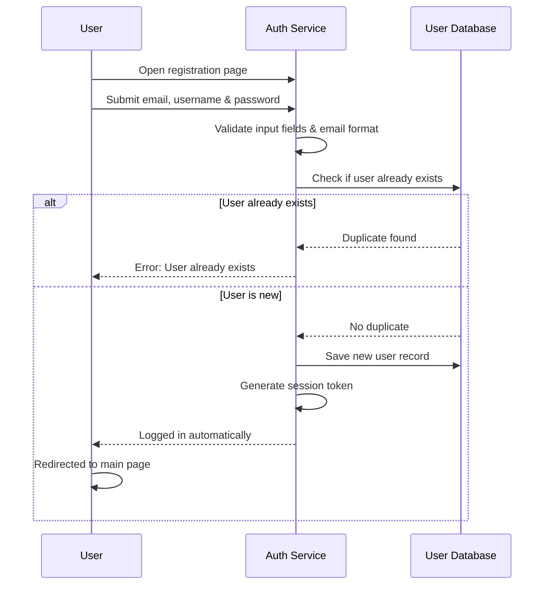

```mermaid
sequenceDiagram
    participant U as User
    participant AS as Auth Service
    participant DB as User Database

    U->>AS: Open registration page
    U->>AS: Submit email, username & password
    AS->>AS: Validate input fields & email format
    AS->>DB: Check if user already exists
    alt User already exists
        DB-->>AS: Duplicate found
        AS-->>U: Error: User already exists
    else User is new
        DB-->>AS: No duplicate
        AS->>DB: Save new user record
        AS->>AS: Generate session token
        AS-->>U: Logged in automatically
        U->>U: Redirected to main page
    end
```