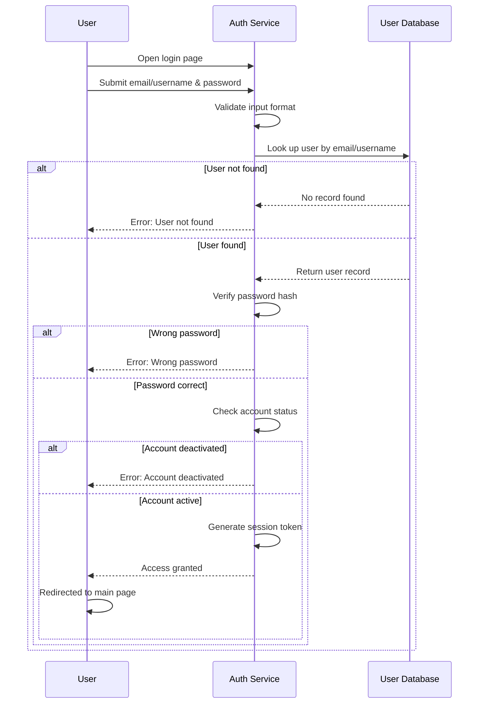

```mermaid
sequenceDiagram
    participant U as User
    participant AS as Auth Service
    participant DB as User Database

    U->>AS: Open login page
    U->>AS: Submit email/username & password
    AS->>AS: Validate input format
    AS->>DB: Look up user by email/username
    alt User not found
        DB-->>AS: No record found
        AS-->>U: Error: User not found
    else User found
        DB-->>AS: Return user record
        AS->>AS: Verify password hash
        alt Wrong password
            AS-->>U: Error: Wrong password
        else Password correct
            AS->>AS: Check account status
            alt Account deactivated
                AS-->>U: Error: Account deactivated
            else Account active
                AS->>AS: Generate session token
                AS-->>U: Access granted
                U->>U: Redirected to main page
            end
        end
    end
```