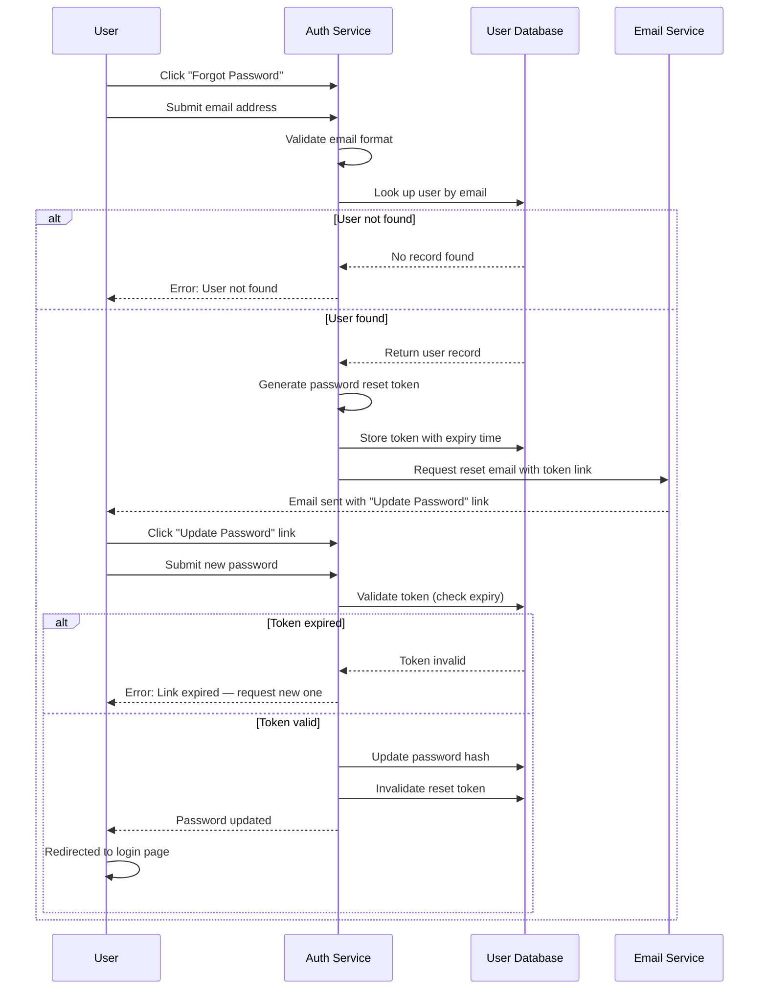

```mermaid
sequenceDiagram
    participant U as User
    participant AS as Auth Service
    participant DB as User Database
    participant ES as Email Service

    U->>AS: Click "Forgot Password"
    U->>AS: Submit email address
    AS->>AS: Validate email format
    AS->>DB: Look up user by email
    alt User not found
        DB-->>AS: No record found
        AS-->>U: Error: User not found
    else User found
        DB-->>AS: Return user record
        AS->>AS: Generate password reset token
        AS->>DB: Store token with expiry time
        AS->>ES: Request reset email with token link
        ES-->>U: Email sent with "Update Password" link
        U->>AS: Click "Update Password" link
        U->>AS: Submit new password
        AS->>DB: Validate token (check expiry)
        alt Token expired
            DB-->>AS: Token invalid
            AS-->>U: Error: Link expired — request new one
        else Token valid
            AS->>DB: Update password hash
            AS->>DB: Invalidate reset token
            AS-->>U: Password updated
            U->>U: Redirected to login page
        end
    end
```