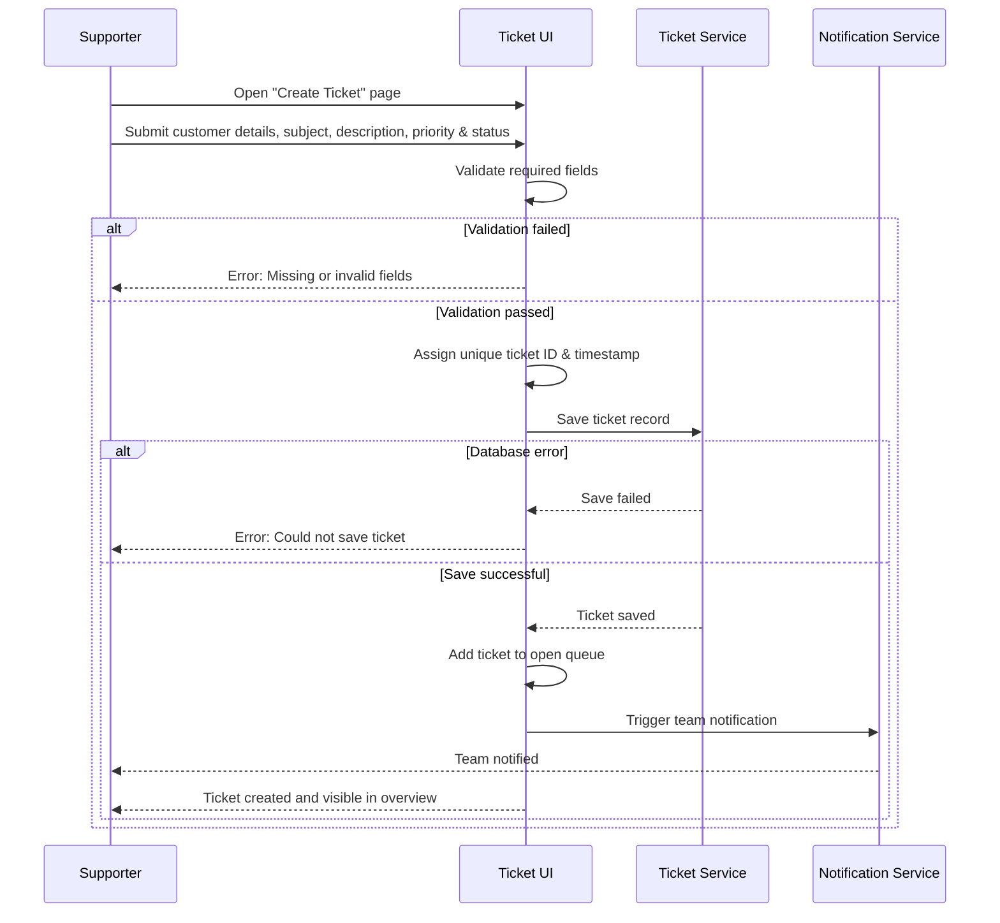

```mermaid
sequenceDiagram
    participant S as Supporter
    participant TS as Ticket UI
    participant DB as Ticket Service
    participant NS as Notification Service

    S->>TS: Open "Create Ticket" page
    S->>TS: Submit customer details, subject, description, priority & status
    TS->>TS: Validate required fields
    alt Validation failed
        TS-->>S: Error: Missing or invalid fields
    else Validation passed
        TS->>TS: Assign unique ticket ID & timestamp
        TS->>DB: Save ticket record
        alt Database error
            DB-->>TS: Save failed
            TS-->>S: Error: Could not save ticket
        else Save successful
            DB-->>TS: Ticket saved
            TS->>TS: Add ticket to open queue
            TS->>NS: Trigger team notification
            NS-->>S: Team notified
            TS-->>S: Ticket created and visible in overview
        end
    end
```