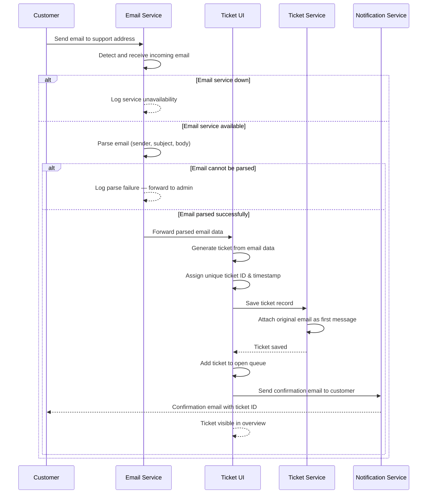

```mermaid
sequenceDiagram
    participant C as Customer
    participant ES as Email Service
    participant TS as Ticket UI
    participant DB as Ticket Service
    participant NS as Notification Service

    C->>ES: Send email to support address
    ES->>ES: Detect and receive incoming email
    alt Email service down
        ES-->>ES: Log service unavailability
    else Email service available
        ES->>ES: Parse email (sender, subject, body)
        alt Email cannot be parsed
            ES-->>ES: Log parse failure — forward to admin
        else Email parsed successfully
            ES->>TS: Forward parsed email data
            TS->>TS: Generate ticket from email data
            TS->>TS: Assign unique ticket ID & timestamp
            TS->>DB: Save ticket record
            DB->>DB: Attach original email as first message
            DB-->>TS: Ticket saved
            TS->>TS: Add ticket to open queue
            TS->>NS: Send confirmation email to customer
            NS-->>C: Confirmation email with ticket ID
            TS-->>TS: Ticket visible in overview
        end
    end
```