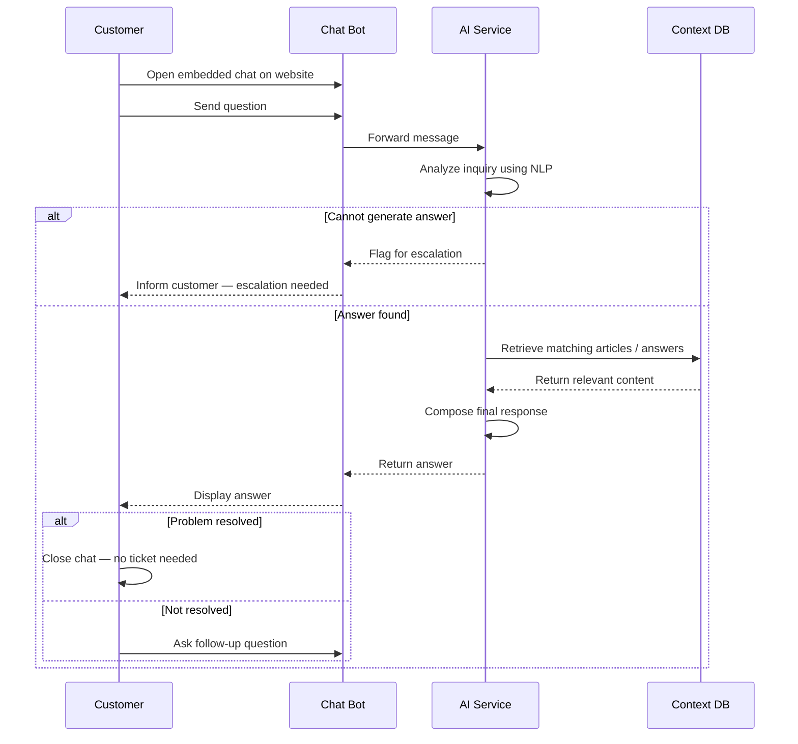

```mermaid
sequenceDiagram
    participant C as Customer
    participant CG as Chat Bot
    participant AI as AI Service
    participant KB as Context DB

    C->>CG: Open embedded chat on website
    C->>CG: Send question
    CG->>AI: Forward message
    AI->>AI: Analyze inquiry using NLP
    alt Cannot generate answer
        AI-->>CG: Flag for escalation
        CG-->>C: Inform customer — escalation needed
    else Answer found
        AI->>KB: Retrieve matching articles / answers
        KB-->>AI: Return relevant content
        AI->>AI: Compose final response
        AI-->>CG: Return answer
        CG-->>C: Display answer
        alt Problem resolved
            C->>C: Close chat — no ticket needed
        else Not resolved
            C->>CG: Ask follow-up question
        end
    end
```