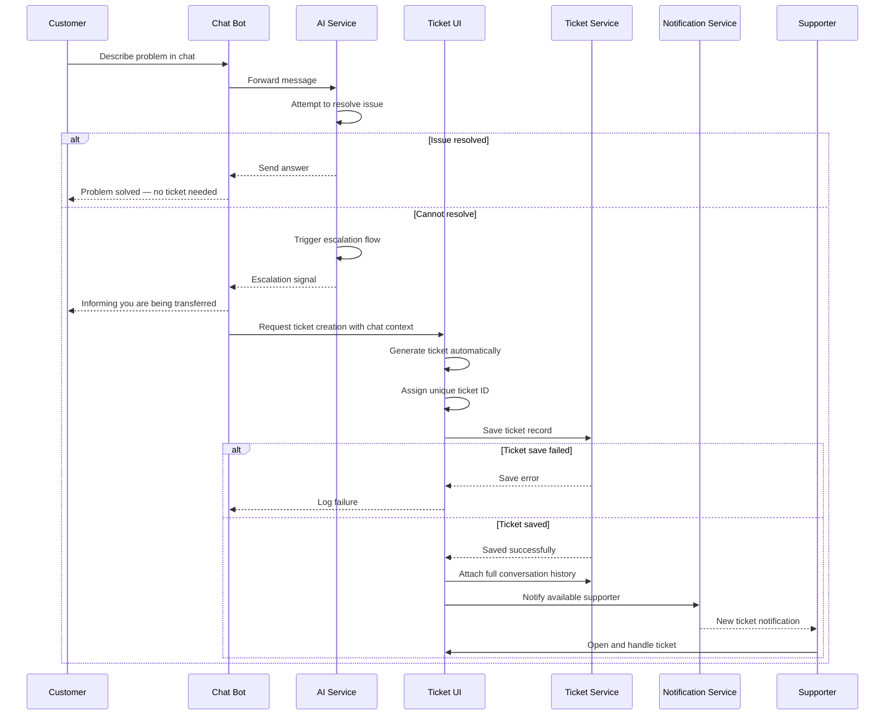

```mermaid
sequenceDiagram
    participant C as Customer
    participant CG as Chat Bot
    participant AI as AI Service
    participant TS as Ticket UI
    participant DB as Ticket Service
    participant NS as Notification Service
    participant S as Supporter

    C->>CG: Describe problem in chat
    CG->>AI: Forward message
    AI->>AI: Attempt to resolve issue
    alt Issue resolved
        AI-->>CG: Send answer
        CG-->>C: Problem solved — no ticket needed
    else Cannot resolve
        AI->>AI: Trigger escalation flow
        AI-->>CG: Escalation signal
        CG-->>C: Informing you are being transferred
        CG->>TS: Request ticket creation with chat context
        TS->>TS: Generate ticket automatically
        TS->>TS: Assign unique ticket ID
        TS->>DB: Save ticket record
        alt Ticket save failed
            DB-->>TS: Save error
            TS-->>CG: Log failure
        else Ticket saved
            DB-->>TS: Saved successfully
            TS->>DB: Attach full conversation history
            TS->>NS: Notify available supporter
            NS-->>S: New ticket notification
            S->>TS: Open and handle ticket
        end
    end
```