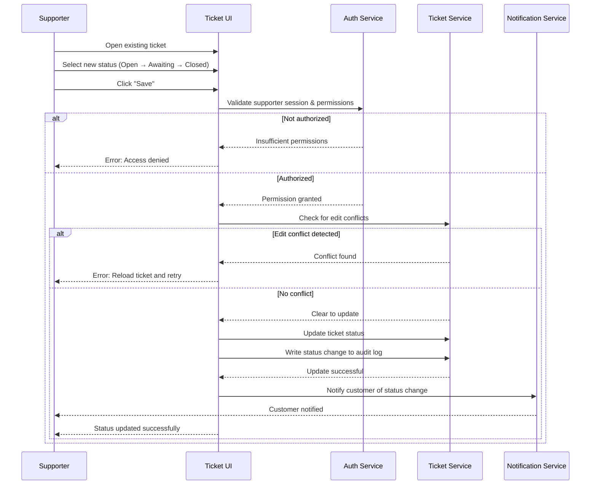

```mermaid
sequenceDiagram
    participant S as Supporter
    participant TS as Ticket UI
    participant AS as Auth Service
    participant DB as Ticket Service
    participant NS as Notification Service

    S->>TS: Open existing ticket
    S->>TS: Select new status (Open → Awaiting → Closed)
    S->>TS: Click "Save"
    TS->>AS: Validate supporter session & permissions
    alt Not authorized
        AS-->>TS: Insufficient permissions
        TS-->>S: Error: Access denied
    else Authorized
        AS-->>TS: Permission granted
        TS->>DB: Check for edit conflicts
        alt Edit conflict detected
            DB-->>TS: Conflict found
            TS-->>S: Error: Reload ticket and retry
        else No conflict
            DB-->>TS: Clear to update
            TS->>DB: Update ticket status
            TS->>DB: Write status change to audit log
            DB-->>TS: Update successful
            TS->>NS: Notify customer of status change
            NS-->>S: Customer notified
            TS-->>S: Status updated successfully
        end
    end
```