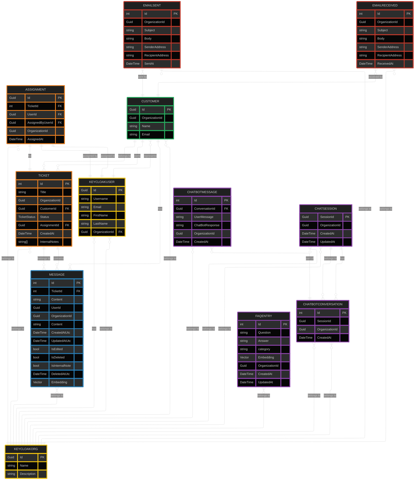

## Entity Relationship Diagram

```mermaid
---
config:
  layout: elk
  theme: dark
---
erDiagram
    TICKET ::: TicketService {
        int Id PK
        string Title
        Guid OrganizationId
        Guid CustomerId FK
        TicketStatus Status
        Guid AssignmentId FK
        DateTime CreatedAt
        string[] InternalNotes
    }
    ASSIGNMENT ::: TicketService {
        Guid Id PK
        int TicketId FK
        Guid UserId FK
        Guid AssignedByUserId FK
        Guid OrganizationId
        DateTime AssignedAt
    }
    MESSAGE  ::: MessagingService {
        int Id PK
        int TicketId FK
        string Content
        Guid UserId
        Guid OrganizationId
        string Content
        DateTime CreatedAtUtc
        DateTime UpdatedAtUtc
        bool IsEdited
        bool IsDeleted
        bool IsInternalNote
        DateTime DeletedAtUtc
        Vector Embedding
    }
    CUSTOMER ::: CustomerService {
        Guid Id PK
        Guid OrganizationId
        string Name
        string Email
    }

    FAQENTRY ::: ChatBotService {
        int Id PK
        string Question
        string Answer
        string category
        Vector Embedding
        Guid OrganizationId
        DateTime CreatedAt
        DateTime UpdatedAt
    }

    CHATBOTCONVERSATION ::: ChatBotService {
        int Id PK
        Guid SessionId
        Guid OrganizationId
        DateTime CreatedAt
    }

    CHATBOTMESSAGE ::: ChatBotService {
        int Id PK
        Guid ConversationId FK
        string UserMessage
        string ChatBotResponse
        Guid OrganizationId
        DateTime CreatedAt
    }

    CHATSESSION ::: ChatBotService {
        Guid SessionId PK
        Guid OrganizationId
        DateTime CreatedAt
        DateTime UpdatedAt
    }

    EMAILSENT ::: EmailService {
        int Id PK
        Guid OrganizationId
        string Subject
        string Body
        string SenderAddress
        string RecipientAddress
        DateTime SentAt
    }
    EMAILRECEIVED ::: EmailService {
        int Id PK
        Guid OrganizationId
        string Subject
        string Body
        string SenderAddress
        string RecipientAddress
        DateTime ReceivedAt
    }
    KEYCLOAKUSER ::: KeycloakService {
        Guid Id PK
        string Username
        string Email
        string FirstName
        string LastName
        Guid OrganizationId FK
    }
    KEYCLOAKORG ::: KeycloakService {
        Guid Id PK
        string Name
        string Description
    }


    TICKET  ||--o{ MESSAGE : contains
    MESSAGE }o--|| TICKET : "belongs to"
    CUSTOMER ||--o{ TICKET : owns
    TICKET}o--|| CUSTOMER : "belongs to"
    CUSTOMER ||--o{ MESSAGE : "has"
    EMAILSENT }o--|| CUSTOMER : "sent by"
    EMAILRECEIVED }o--|| CUSTOMER : "received by"
    KEYCLOAKORG  ||--o{ KEYCLOAKUSER : has
    KEYCLOAKUSER  }o--|| KEYCLOAKORG : "belongs to"
    KEYCLOAKUSER  ||--o{ CUSTOMER : "represents"
    TICKET }o--|| KEYCLOAKORG : "belongs to"
    MESSAGE }o--|| KEYCLOAKORG : "belongs to"
    CUSTOMER }o--|| KEYCLOAKORG : "belongs to"

    EMAILSENT }o--|| KEYCLOAKORG : "belongs to"
    EMAILRECEIVED }o--|| KEYCLOAKORG : "belongs to"

    ASSIGNMENT ||--|| KEYCLOAKUSER : "assigned to"
    ASSIGNMENT ||--|| KEYCLOAKUSER : "assigned by"
    ASSIGNMENT ||--|| TICKET : "for"


    FAQENTRY }o--|| KEYCLOAKORG : "belongs to"
    CHATBOTMESSAGE }o--|| CHATBOTCONVERSATION : "part of"
    CHATBOTCONVERSATION }o--|| KEYCLOAKORG : "belongs to"
    CHATSESSION }o--|| KEYCLOAKORG : "belongs to"
    CHATSESSION ||--o{CHATBOTCONVERSATION : "has"
    CHATBOTCONVERSATION}o--|| CHATSESSION : "belongs to"

    ASSIGNMENT }o--|| KEYCLOAKORG : "belongs to"
    CHATBOTMESSAGE }o--|| KEYCLOAKORG : "belongs to"
    CHATBOTCONVERSATION }o--|| KEYCLOAKORG : "belongs to"
    CHATSESSION }o--|| KEYCLOAKORG : "belongs to"

    classDef TicketService stroke:#e67e22,stroke-width:4px;
    classDef MessagingService stroke:#2980b9,stroke-width:4px;
    classDef CustomerService stroke:#27ae60,stroke-width:4px;
    classDef ChatBotService stroke:#8e44ad,stroke-width:4px;
    classDef EmailService stroke:#c0392b,stroke-width:4px;
    classDef KeycloakService stroke:#f1c40f,stroke-width:4px;
    classDef IdentityService stroke:#16a085,stroke-width:4px;
```
