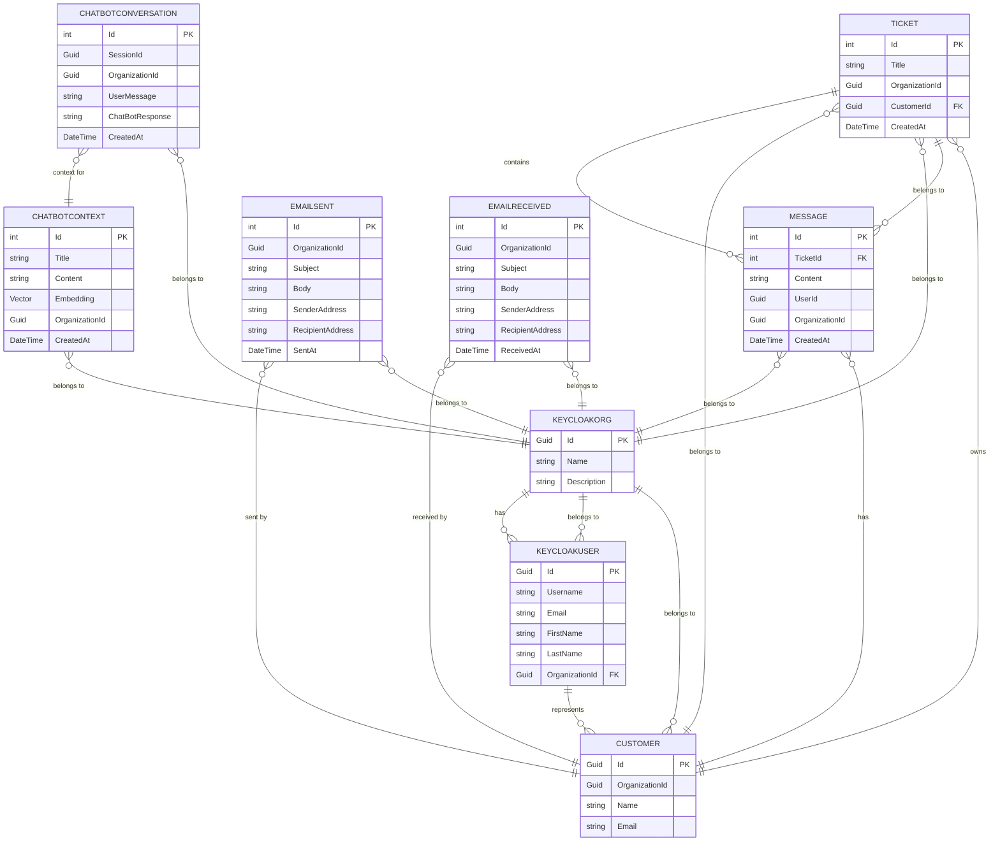

## Entity Relationship Diagram

```mermaid
erDiagram
    TICKET {
        int Id PK
        string Title
        Guid OrganizationId
        Guid CustomerId FK
        DateTime CreatedAt
    }
    MESSAGE {
        int Id PK
        int TicketId FK
        string Content
        Guid UserId
        Guid OrganizationId
        DateTime CreatedAt
    }
    CUSTOMER {
        Guid Id PK
        Guid OrganizationId
        string Name
        string Email
    }
    CHATBOTCONTEXT {
        int Id PK
        string Title
        string Content
        Vector Embedding
        Guid OrganizationId
        DateTime CreatedAt
    }
    CHATBOTCONVERSATION {
        int Id PK
        Guid SessionId
        Guid OrganizationId
        string UserMessage
        string ChatBotResponse
        DateTime CreatedAt
    }
    EMAILSENT {
        int Id PK
        Guid OrganizationId
        string Subject
        string Body
        string SenderAddress
        string RecipientAddress
        DateTime SentAt
    }
    EMAILRECEIVED {
        int Id PK
        Guid OrganizationId
        string Subject
        string Body
        string SenderAddress
        string RecipientAddress
        DateTime ReceivedAt
    }
    KEYCLOAKUSER {
        Guid Id PK
        string Username
        string Email
        string FirstName
        string LastName
        Guid OrganizationId FK
    }
    KEYCLOAKORG {
        Guid Id PK
        string Name
        string Description
    }

    TICKET ||--o{ MESSAGE : contains
    MESSAGE }o--|| TICKET : "belongs to"
    CUSTOMER ||--o{ TICKET : owns
    TICKET }o--|| CUSTOMER : "belongs to"
    CUSTOMER ||--o{ MESSAGE : "has"
    EMAILSENT }o--|| CUSTOMER : "sent by"
    EMAILRECEIVED }o--|| CUSTOMER : "received by"
    CHATBOTCONVERSATION }o--|| CHATBOTCONTEXT : "context for"
    KEYCLOAKORG ||--o{ KEYCLOAKUSER : has
    KEYCLOAKUSER }o--|| KEYCLOAKORG : "belongs to"
    KEYCLOAKUSER ||--o{ CUSTOMER : "represents"
    TICKET }o--|| KEYCLOAKORG : "belongs to"
    MESSAGE }o--|| KEYCLOAKORG : "belongs to"
    CUSTOMER }o--|| KEYCLOAKORG : "belongs to"
    CHATBOTCONTEXT }o--|| KEYCLOAKORG : "belongs to"
    CHATBOTCONVERSATION }o--|| KEYCLOAKORG : "belongs to"
    EMAILSENT }o--|| KEYCLOAKORG : "belongs to"
    EMAILRECEIVED }o--|| KEYCLOAKORG : "belongs to"
```
